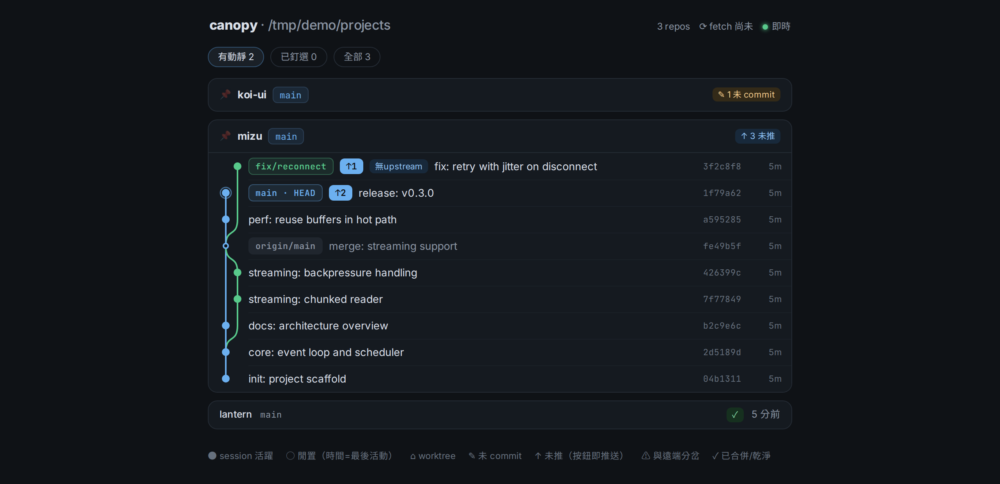

# canopy

站在所有 worktree 之上的即時 git 線圖面板。

一次開好幾個 Claude Code session 平行工作時，每個 session 都在自己的 worktree
裡開拋棄式分支，最想知道的就是「現在到底有幾條分支、各自走到哪、誰跟誰還沒合、
哪些還沒推」。canopy 掃描一個根目錄底下的所有 git repo，把這些狀態畫成一張
即時的提交線圖，並讓你直接在面板上執行推送。



> 畫面為示範資料（虛構 repo）。展開的線圖裡：HEAD 鏈固定在最左道、合流曲線、
> 分支色塊旁的 `↑N` 即推送按鈕、`無 upstream` 與未 commit 髒污等狀態徽章。

## 功能

- **全景掃描**：走訪根目錄找出所有 repo。worktree 以 `git-common-dir` 去重併回
  主 repo，submodule 正確地以獨立 repo 現身，worktree 裡的 submodule 副本則被排除。
- **SVG 線圖**：自繪的 lane 排版與合流曲線，HEAD 所在的鏈固定畫在最左道。
- **狀態訊號**：每條分支的 ahead/behind、無 upstream、與遠端分岔、worktree 未
  commit 的髒污、已合併未清的分支，以及 Claude session 的活性（●活躍／○閒置多久）。
- **面板上推送**：分支色塊旁的 `↑N` 按鈕（N＝未推的 commit 數），按下先顯示
  commit 清單與目標 remote，確認才執行。指令固定由伺服器組成
  `git push <remote> <分支>`，推 main/master 需要多一層確認。
- **即時更新**：inotify 盯住每個 repo 的 refs，變動後以 SSE 推播；另有定期
  `git fetch --prune` 讓 ahead/behind 保持準確。
- **雙模前端**：同一份程式碼，正常情況走 fetch + SSE 的即時模式；萬一所在環境
  封鎖了頁面執行期的網路（見下方面板一節），會自動退回「資料嵌在 HTML、互動走
  連結與表單、定時重載」的靜態模式，功能一樣齊，代價是重載看得見。

## 建置與安裝

需求：Go 1.22+、Node 20+、git 2.5+。

```bash
make            # 前端 build → 嵌入 → 編譯出單一執行檔 ./canopy
make install    # build → 部署 unit 複本 → enable ＋ restart（冪等）
make status     # 對帳：binary 在不在、unit 複本有沒有分岔、服務與面板活著沒
make uninstall  # 拆服務與 unit 複本；build 產物另由 make clean 清
```

前端以單檔模式打包（所有 JS/CSS 內嵌），再用 `go:embed` 進 binary，
所以產物就是一個檔案。

## 使用

```bash
./canopy                          # 預設掃 ~/projects，聽 127.0.0.1:7777
./canopy -root ~/code -addr 127.0.0.1:8888
GITGRAPH_ROOT=~/code ./canopy     # 環境變數同義
```

瀏覽器開 `http://127.0.0.1:7777` 即可。

### 在 Claude Code Desktop 的瀏覽器面板裡用

面板只認得「解析回本機的公網網域」這種寫法，直接給 `127.0.0.1` 或 `localhost`
的連結會被丟到系統預設瀏覽器。所以入口要用：

```
http://127-0-0-1.nip.io:7777
```

在聊天裡點這個連結、選 **Open in app**、第一次選 **Always allow**。

接著會發生一件你只在網址列看得到的事：頁面一載入就自己跳到
`http://127.0.0.1:7777`。原因是 nip.io 這種「公開網域名稱解析到私有位址」的
來源，正好是 Chromium 那道 DNS rebinding 防護盯的目標，從它載入的頁面連同源
的 fetch 都發不出去；換成純 IP 位址就一切正常。跳過去之後，面板的行為就跟一般
瀏覽器一樣，走即時模式。

這個跳轉踩在面板肯不肯讓頁面自己導航這件事上，而那不在 canopy 控制範圍內。
哪天它不肯了，canopy 會偵測到並退回靜態模式——功能一項不缺，只是每 10 秒
重載一次的畫面重繪看得見。右上角顯示「資料 N 秒前 ⟳」就是退路正在生效，
顯示綠點「即時」則是走在正常路徑上。細節見 `CLAUDE.md` 的環境約束一節。

## API

| 路徑 | 說明 |
|---|---|
| `GET /` | 面板本體（含嵌入的啟動資料） |
| `GET /api/repos` | 所有 repo 的摘要 |
| `GET /api/repo?id=` | 單一 repo 的完整快照 |
| `GET /api/push-preview?id=&branch=&remote=` | 推送前的 commit 清單 |
| `POST /api/push` | 執行推送（JSON 或表單；Origin 白名單保護） |
| `GET /api/events` | SSE 推播 |
| `GET /diag` | 執行環境能力診斷頁（加 `?jump=1` 會先跳到 127.0.0.1 再測） |
| `GET /mockup` | UI 視覺定稿（2026-08-26 拍板的設計基準） |
