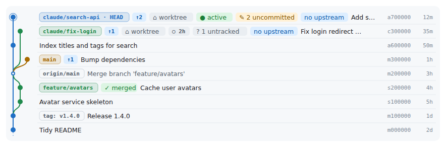

# canopy

A git graph inside Claude Code. [繁體中文](README.zh-TW.md)

When several Claude Code sessions work in parallel, each in its own worktree, the
question you keep asking is: how many branches are there now, where is each one, and
what hasn't been pushed? canopy answers it without leaving Claude Code. It nudges you
above the prompt when the session's branch has unpushed commits, and one click opens
the whole tree.

<picture>
  <source media="(prefers-color-scheme: dark)" srcset="docs/graph-dark.png">
  
</picture>

<sub>Example data from a made-up repository.</sub>

## What it does

- **A nudge above the prompt** when the branch the session is on has commits that
  are not on any remote: `↑3 claude/search-api has 3 commits not on any remote
  [View graph] [Not now]`. *Not now* hides it until the branch moves again.
- **The graph pane** (*View graph*, or `/canopy`). On top, the repository's branches
  with their state: unpushed (`↑N`) and behind (`↓N`) counts, which worktree holds
  them, whether that worktree's Claude session is active, uncommitted changes,
  merged into the main worktree's branch. Below, the commit graph with forks, merges,
  branch labels and remote branches. Expand the pane with its ⤢ button.
- **Keeps itself current**: after every turn, after Claude runs a git command, and
  on a timer.
- **Read-only**: it runs `git` locally to look, and never fetches, pushes or writes.

On a terminal the pane draws the graph with box-drawing characters:

```
●      [claude/search-api] Add search endpoint with paging
│ ●    [claude/fix-login] Fix login redirect on expired sessions
● │    Index titles and tags for search
│ │ ●  [main] Bump dependencies
○─┼─╯  Merge branch 'feature/avatars'
│ ●    [feature/avatars] Cache user avatars
│ ●    Avatar service skeleton
●─╯    Release 1.4.0
●      Tidy README
```

## Install

Requirements: Claude Code **2.1.288 or later** and git. canopy is a *mod*, a plugin of
function hooks, which Claude Code still ships as early access: turn them on by adding
this to the `env` block of `~/.claude/settings.json`:

```json
"CLAUDE_CODE_ENABLE_FUNCTION_HOOKS": "1"
```

Then, in Claude Code:

```
/plugin marketplace add MiskaWu/canopy
/plugin install canopy@canopy
```

or from a shell:

```bash
claude plugin marketplace add MiskaWu/canopy && claude plugin install canopy@canopy
```

New sessions load it. Type `/canopy` to open the pane.

## Settings

Open the pane and press **Settings**; the same values are under `/config`.

| Setting | Default | |
|---|---|---|
| Language | English | English or 繁體中文 |
| Auto refresh | every 45 s | 0 turns the timer off; it still refreshes after each turn and after git commands |
| Commits in the graph | 80 | *More commits* in the pane adds this many again, up to 400 |
| Graph theme | Follow the app | or always dark, or always light |

## What it reads

- `git` in the session's working directory: refs, the worktree list, `git status` in
  each worktree, and the log. Every call sets `GIT_OPTIONAL_LOCKS=0`, so a status
  check never takes the index lock away from a session that is committing.
- The modification times of the transcripts in `~/.claude/projects/` for the
  "session active" badge. This is Claude Code's own storage and may change between
  releases; when it cannot be read, the badge is left out.

Nothing leaves your machine.

## Limits

- The graph draws the most recent commits across all branches. A branch that forked
  long ago and hasn't moved may sit below that window: it is still in the branch
  list, and *More commits* reaches further.
- The plugin API is early access and changes between Claude Code releases; canopy is
  tested against the version named above.

## Development

```bash
make test                       # validate the marketplace and the mod, then run its tests
make test CLAUDE=/path/to/claude  # when the claude on PATH is older than 2.1.288
make typecheck                  # tsc, once Claude Code has loaded the mod and written its types
```

To work on canopy itself, load your clone instead of the installed copy: put
`"CLAUDE_CODE_PLUGIN_DIRS": "/path/to/canopy/mod"` in the `env` block of
`~/.claude/settings.json` (and uninstall `canopy@canopy`, so the two don't clash).

The repository is the marketplace (`.claude-plugin/marketplace.json`); the plugin
itself lives in `mod/`. See [CHANGELOG.md](CHANGELOG.md) for releases.

## History

canopy started in August 2026 as a Go server with a React web panel that scanned a
whole `~/projects` folder and could push from the panel. In October 2026 it became
this mod and the server was retired; its last commit is `841bce3`.

## License

[MIT](LICENSE)
